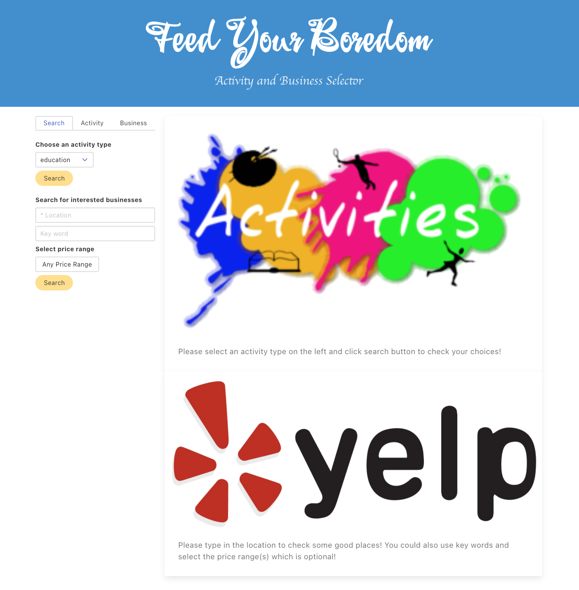
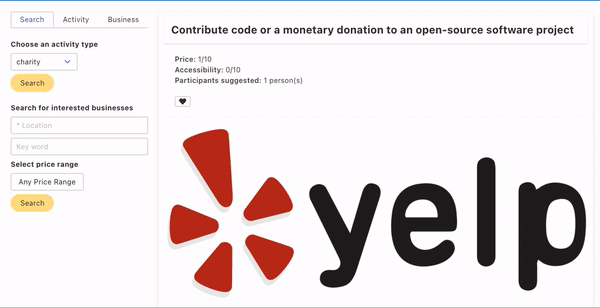
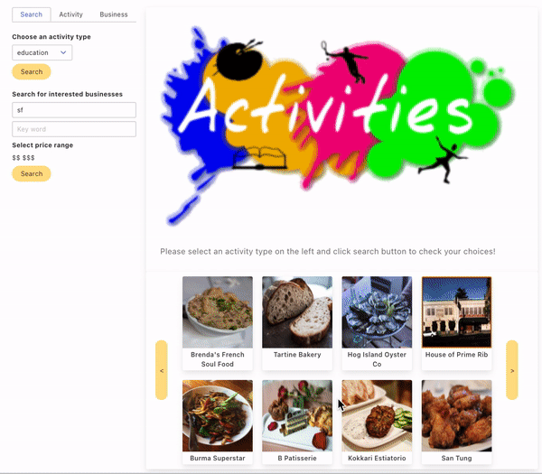
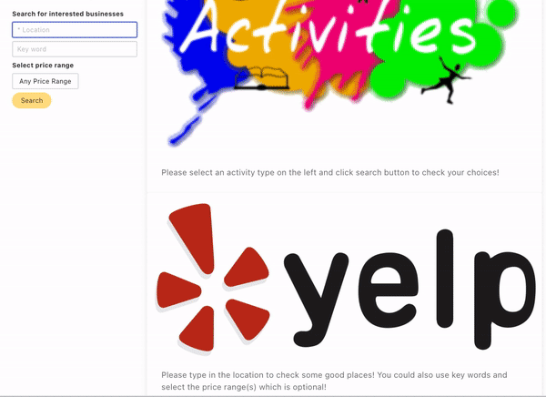
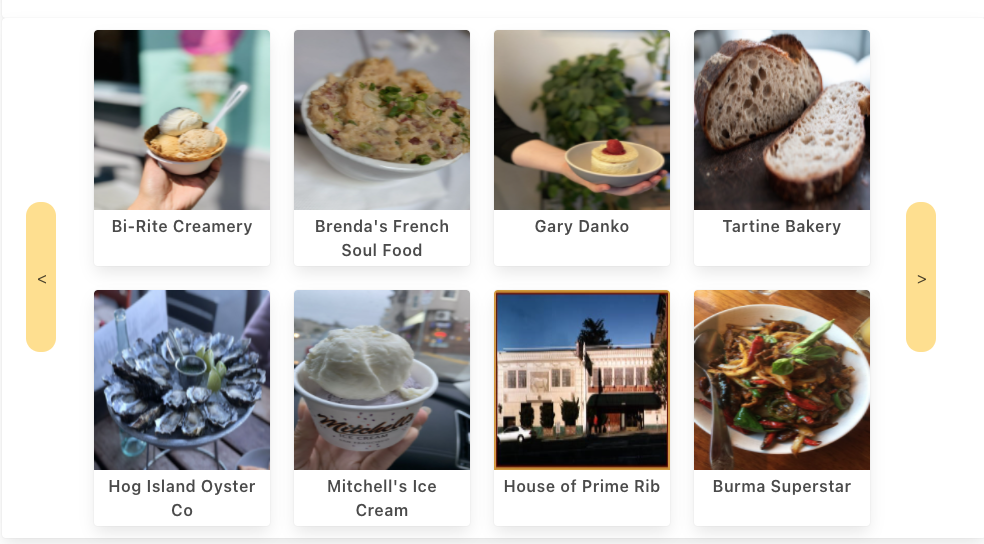
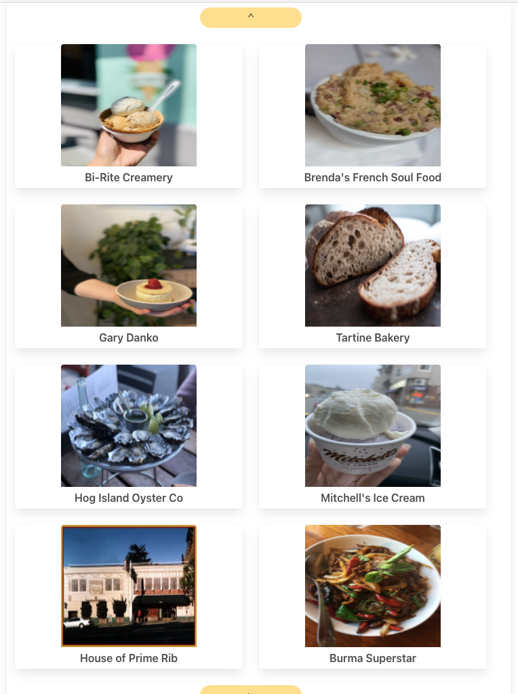
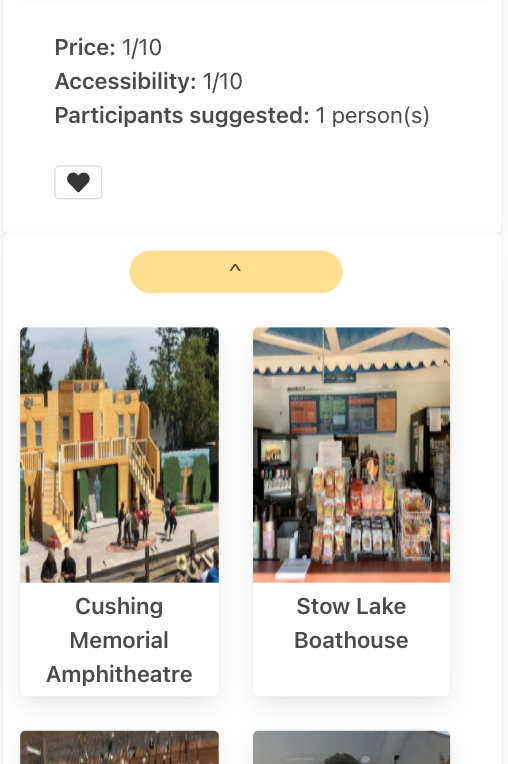
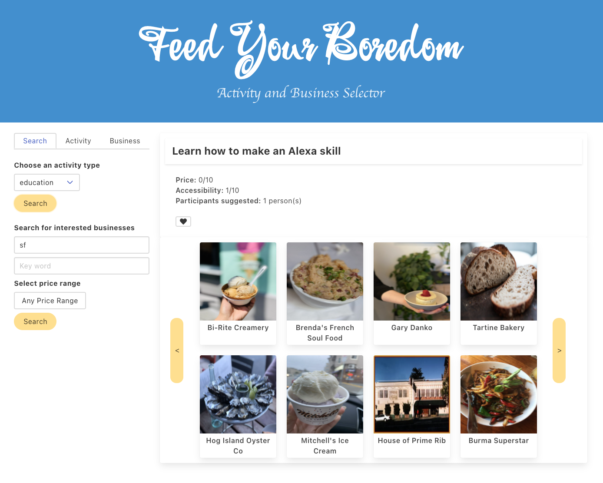
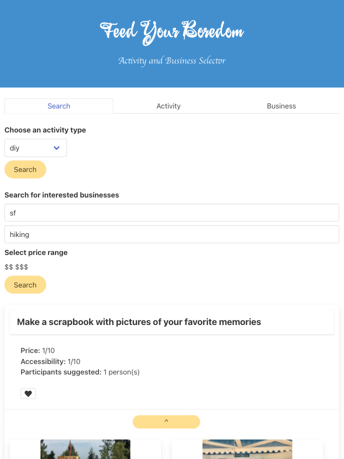
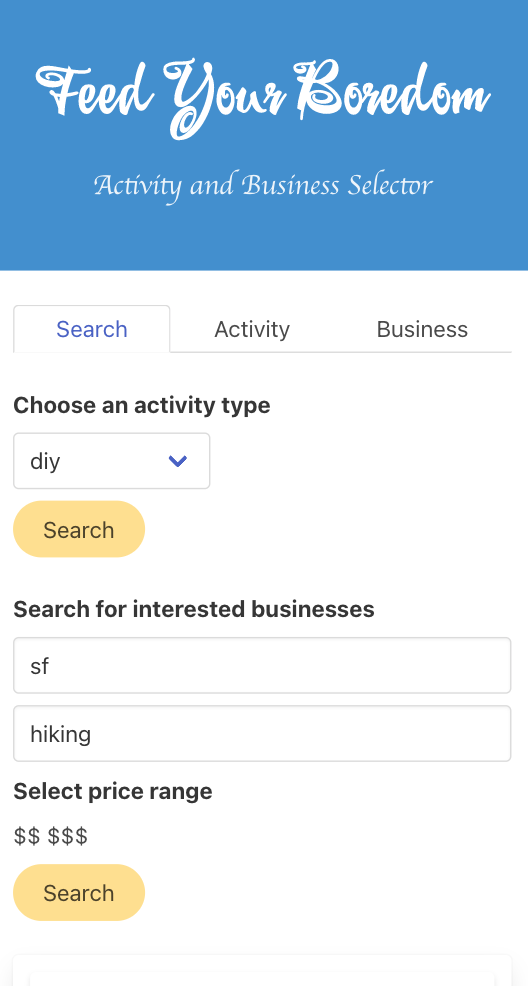

# Feed Your Boredom

We created a platform to end all boredom! The user is lookin for an activity to do with a friend, their family, or even solo. We give them a quick and easy way to find an activity and a restaurant to start their adventure. They can even save their favorite activities and restuarants for use at a later time. The acitivity selector is a random activity generator that they can run again and again. The restaurant selector uses the power of Yelp! In our next update we will be adding the additional function of searching for the activity using yelp as well. This will make doing that activity even easier.

## Getting Started

```console
git clone https://github.com/JessGiannini/FeedYourBoredom.git
```

Our application uses a Yelp API that needs a little extra help to make our website work. We had to use a CORS proxy server to fetch the data needed for our project.

## Built With

- [HTML](https://developer.mozilla.org/en-US/docs/Web/HTML)
- [CSS](https://developer.mozilla.org/en-US/docs/Web/CSS)
- [Javascript](https://developer.mozilla.org/en-US/docs/Web/JavaScript)
- [FontAwesome](https://fontawesome.com/kits/9de12bd4dc/use?welcome=yes)
- [Bulma](https://bulma.io/)
- [GoogleFonts](https://fonts.google.com/)
- [OpenLayer](https://cdn.jsdelivr.net/gh/openlayers/openlayers.github.io@master/en/v6.5.0/build/ol.js)
- [CORSProxy](https://cors.bridged.cc)

## Deployed Link

- [Click to See Live Site](https://jessgiannini.github.io/FeedYourBoredom/)



## Description of the Feed Your Boredom

1. There are 4 main parts in the page: a hero header, a search section and two results display block.
2. The search section includes a tab to select different section related to search: search form, activities search history saved, businesses search history saved
3. There are three sections controlled by the tab:

   - When `Search` is selected, two search forms displayed: activities search form and businesses search form
   - When `Activity` is selected, activities saved by the user previously would be displayed as a panel.
   - When `Business` is selected, businesses saved by the user previously would be displayed as a panel.
   - When user click any term in the panel, the details of it would be displayed on the right.

   

   

   - User can delete all saved items on that panel with a click on corresponding `Clear all saved` button

4. Activities search:
   - User can select the type of activities they like and click `Search` button to checkout the suggestions
   - A random activity of selected type with details would be displayed in the first block on the right.
   - If user find any interested activity, they can click the `Heart` button to save to `LocalStorage` which would also be added to the panel of `Activity`.
5. Businesses search:

   - User can type a location and click search button to check relative businesses nearby.
   - Location is a necessary query parameter to get expected data. If user click `Search` button with `*Location` input blank, a message featured by modal would pop up and let the user know what happened.
   - User can also use keyword and select one or more price range to make the search result more precise so that they can find proper businesses faster
   - The businesses results list would be displayed in the second block on the right. User can click `>` or `<` to check more results

   

   - If user find any interested business, they can click the card to check more details. Then the list is hidden while details showes in the same place.
   - In the businesses details includes business name, price range, rating, distance, phone number address, a small map and its image. User can:
     - Click phone number to make phone call
     - Click address to check the location on Google Map
     - Click the small map to view a larger on featured in `Modal`
     - Click `Go Back` button to go back to results list
     - Click `Heart` button to save to `LocalStorage` which would also be added to the panel of `Business`.

6. The page layout is screen size responsive.







## Page Demo

(assets/images/feedyourboredom.gif)

## Page Screen Shot with Different Screen Width







## Authors

**Jessica Giannini**

- [Link to Portfolio Site](https://jessgiannini.github.io/WebDeveloperPortfolio/)
- [Link to Github](https://github.com/jessgiannini)
- [Link to LinkedIn](https://www.linkedin.com/in/jessica-aletta-giannini-155b1310/)

**Samantha Yuhan**

- [Link to Portfolio Site](https://samyuhan.github.io/portfolio/)
- [Link to Github](https://github.com/samyuhan)
- [Link to LinkedIn](https://www.linkedin.com/in/samanthayuhan/)

**Qiushuang Tian**

- [Link to Portfolio Site](https://qtian13.github.io/)
- [Link to Github](https://github.com/qtian13)
- [Link to LinkedIn](https://www.linkedin.com/in/qiushuang-tian-a9754248/)

See also the list of [contributors](https://github.com/JessGiannini/
FeedYourBoredom/graphs/contributors) who participated in this project.

## Acknowledgments

- Thank you to the libraries we used to style our application! We loved Font Awesome, Bulma, Google Fonts, and Open Layers for giving us tons of styling as well as a functioning map.
- We were inspired by Manuel Nunes and Sarah Cullen for pushing us to stick with our harder concept. As well as supporting us along the way!
- Cheers to our team for pushing through and finding better ways to work with each other!

## URL Page

https://jessgiannini.github.io/FeedYourBoredom/

## Medium Blog Posts

- [J.Giannini](https://medium.com/@jessgiannini/feed-your-boredom-6aa95ca77335)
- [S.Yuhan](https://samyuhan.medium.com/feed-your-boredom-71acb01f84ce)
- [Q.Tian](https://qiushuangt.medium.com/feed-your-boredom-96a1c4798414)
